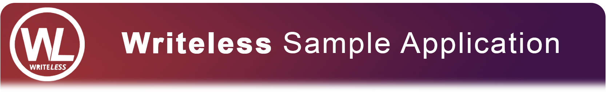

# 

> ### E-commerce writeless sample using ASP.NET Core 2.x and Angular 5.x.

### [Writeless](https://github.com/writeless/writeless)

This sample has the goal to demonstrate how can build a application using Writeless Framework.
The features including CRUD opetations, routing, pagination (soon), authentication (soon), and more.

Is this interesting to you? Learn more in the [Writeless](https://github.com/writeless/writeless) repository (soon).

# What you will find here

- ASP.NET Core
- Entity Framework Core
- CQRS
- MediatR
- AutoMapper
- Fluent Validation
- Feature folders
- JWT authentication (soon)
- Swagger (soon)
